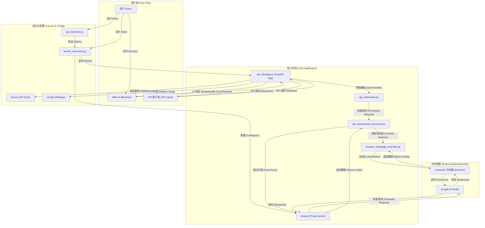

# AI Studio Proxy API

这是一个基于 Python 的代理服务器，用于将 Google AI Studio 的网页界面转换为 OpenAI 兼容的 API。通过 Camoufox (反指纹检测的 Firefox) 和 Playwright 自动化，提供稳定的 API 访问。

[](https://www.star-history.com/#CJackHwang/AIstudioProxyAPI&Date)

This project is generously sponsored by ZMTO. Visit their website: [https://zmto.com/](https://zmto.com/)

本项目由 ZMTO 慷慨赞助服务器支持。访问他们的网站：[https://zmto.com/](https://zmto.com/)

---

## 致谢 (Acknowledgements)

本项目的诞生与发展，离不开以下个人、组织和社区的慷慨支持与智慧贡献：

*   **项目发起与主要开发**: @CJackHwang ([https://github.com/CJackHwang](https://github.com/CJackHwang))
*   **功能完善、页面操作优化思路贡献**: @ayuayue ([https://github.com/ayuayue](https://github.com/ayuayue))
*   **实时流式功能优化与完善**: @luispater ([https://github.com/luispater](https://github.com/luispater))
*   **3400+行主文件项目重构伟大贡献**: @yattin (Holt) ([https://github.com/yattin](https://github.com/yattin))
*   **社区支持与灵感碰撞**: 特别感谢 [Linux.do 社区](https://linux.do/) 成员们的热烈讨论、宝贵建议和问题反馈，你们的参与是项目前进的重要动力。

同时，我们衷心感谢所有通过提交 Issue、提供建议、分享使用体验、贡献代码修复等方式为本项目默默奉献的每一位朋友。是你们共同的努力，让这个项目变得更好！

---

**这是当前维护的 Python 版本。不再维护的 Javascript 版本请参见 [`deprecated_javascript_version/README.md`](deprecated_javascript_version/README.md)。**

## 系统要求

*   **Python**: 3.9+ (推荐 3.10+ 或 3.11+)
*   **操作系统**: Windows, macOS, Linux (完全跨平台支持)
*   **内存**: 建议 2GB+ 可用内存
*   **网络**: 稳定的互联网连接访问 Google AI Studio

## 主要特性

*   **OpenAI 兼容 API**: 支持 `/v1/chat/completions` 端点，兼容现有的 OpenAI 客户端
*   **流式和非流式响应**: 支持实时流式输出和传统的完整响应
*   **模型切换**: 通过 API 请求中的 `model` 字段动态切换 AI Studio 中的模型
*   **参数控制**: 支持 `temperature`, `max_output_tokens`, `top_p`, `stop` 等参数
*   **反指纹检测**: 使用 Camoufox 降低被检测为自动化脚本的风险
*   **多种响应获取方式**: 集成流式代理、外部 Helper 服务、Playwright 页面交互
*   **Web UI**: 内置现代化的测试界面，支持聊天、状态监控、安全的API密钥管理
*   **图形界面启动器**: 提供 GUI 启动器，简化配置和管理
*   **灵活的认证系统**: 支持可选的API密钥认证，兼容OpenAI标准的Bearer token

## 系统架构



## 配置管理 ⭐

**新功能**: 项目现在支持通过 `.env` 文件进行配置管理，避免硬编码参数！

### 快速配置

```bash
# 1. 复制配置模板
cp .env.example .env

# 2. 编辑配置文件
nano .env  # 或使用其他编辑器

# 3. 启动服务（自动读取配置）
python gui_launcher.py
```

### 主要优势

- ✅ **版本更新无忧**: 一个 `git pull` 就完成更新，无需重新配置
- ✅ **配置集中管理**: 所有配置项统一在 `.env` 文件中
- ✅ **安全性**: `.env` 文件已被 `.gitignore` 忽略，不会泄露配置
- ✅ **灵活性**: 支持不同环境的配置管理
- ✅ **Docker 兼容**: Docker 和本地环境使用相同的配置方式

详细配置说明请参见 [环境变量配置指南](docs/environment-configuration.md)。

## 使用教程

推荐使用 [`gui_launcher.py`](gui_launcher.py) (图形界面) 或直接使用 [`launch_camoufox.py`](launch_camoufox.py) (命令行) 进行日常运行。仅在首次设置或认证过期时才需要使用调试模式。

### 快速开始

1. **安装**: 参见 [安装指南](docs/installation-guide.md)
2. **配置**: 参见 [环境变量配置指南](docs/environment-configuration.md) - **推荐先配置**
3. **首次认证**: 参见 [认证设置指南](docs/authentication-setup.md)
4. **日常运行**: 参见 [日常运行指南](docs/daily-usage.md)
5. **API使用**: 参见 [API使用指南](docs/api-usage.md)
6. **Web界面**: 参见 [Web UI使用指南](docs/webui-guide.md)

### 详细文档

- [安装指南](docs/installation-guide.md) - 详细的安装步骤和环境配置
- [环境变量配置指南](docs/environment-configuration.md) - **.env 文件配置管理** ⭐
- [认证设置指南](docs/authentication-setup.md) - 首次运行与认证文件设置
- [日常运行指南](docs/daily-usage.md) - 日常使用和配置选项
- [API使用指南](docs/api-usage.md) - API端点和客户端配置
- [Web UI使用指南](docs/webui-guide.md) - Web界面功能说明
- [故障排除指南](docs/troubleshooting.md) - 常见问题解决方案
- [高级配置指南](docs/advanced-configuration.md) - 高级功能和配置选项
- [日志控制指南](docs/logging-control.md) - 日志系统配置和调试
- [依赖版本说明](docs/dependency-versions.md) - Python版本要求和依赖兼容性详解

## 客户端配置示例

以 Open WebUI 为例：

1. 打开 Open WebUI
2. 进入 "设置" -> "连接"
3. 在 "模型" 部分，点击 "添加模型"
4. **模型名称**: 输入你想要的名字，例如 `aistudio-gemini-py`
5. **API 基础 URL**: 输入 `http://127.0.0.1:2048/v1`
6. **API 密钥**: 留空或输入任意字符
7. 保存设置并开始聊天

---

## Docker 部署

本项目支持通过 Docker 进行部署，**现在完全支持 `.env` 配置文件**！

> 📁 **注意**: 所有 Docker 相关文件已移至 `docker/` 目录，保持项目根目录整洁。

### 快速 Docker 部署

```bash
# 1. 准备配置文件
cp docker/.env.docker .env
nano .env  # 编辑配置

# 2. 使用 Docker Compose 启动
cd docker
docker-compose up -d

# 3. 版本更新
cd .. && git pull && cd docker && docker-compose up -d --build
```

### 详细文档

- [Docker 部署指南 (docker/README-Docker.md)](docker/README-Docker.md) - 包含完整的 `.env` 配置说明
- [Docker 快速指南 (docker/README.md)](docker/README.md) - 快速开始指南

### 重要说明

- ✅ **配置统一**: Docker 和本地环境使用相同的 `.env` 配置方式
- ✅ **版本更新**: `git pull` + `docker-compose up -d --build` 即可完成更新
- ✅ **目录整洁**: Docker 文件已移至 `docker/` 目录
- ⚠️ **认证文件**: 首次运行需要在主机上获取认证文件，然后挂载到容器中

---

## 关于 Camoufox

本项目使用 [Camoufox](https://camoufox.com/) 来提供具有增强反指纹检测能力的浏览器实例。

*   **核心目标**: 模拟真实用户流量，避免被网站识别为自动化脚本或机器人
*   **实现方式**: Camoufox 基于 Firefox，通过修改浏览器底层 C++ 实现来伪装设备指纹（如屏幕、操作系统、WebGL、字体等），而不是通过容易被检测到的 JavaScript 注入
*   **Playwright 兼容**: Camoufox 提供了与 Playwright 兼容的接口
*   **Python 接口**: Camoufox 提供了 Python 包，可以通过 `camoufox.server.launch_server()` 启动其服务，并通过 WebSocket 连接进行控制

使用 Camoufox 的主要目的是提高与 AI Studio 网页交互时的隐蔽性，减少被检测或限制的可能性。但请注意，没有任何反指纹技术是绝对完美的。

## 重要提示

### 响应获取与参数控制

*   **响应获取优先级**: 项目采用多层响应获取机制：
    1. **集成的流式代理服务**: 默认启用，提供最佳性能
    2. **外部 Helper 服务**: 可选配置
    3. **Playwright 页面交互**: 后备方案

*   **参数控制**: API 请求中的模型参数（如 `temperature`, `max_output_tokens`, `top_p`, `stop`）**仅在通过 Playwright 页面交互获取响应时生效**。使用集成流式代理或外部 Helper 服务时，参数传递取决于这些服务的实现。

### 客户端管理历史

**客户端管理历史，代理不支持 UI 内编辑**: 客户端负责维护完整的聊天记录并将其发送给代理。代理服务器本身不支持在 AI Studio 界面中对历史消息进行编辑或分叉操作。

## 未来计划

以下是一些计划中的改进方向：

*   **云服务器部署指南**: 提供更详细的在主流云平台上部署和管理服务的指南
*   **认证更新流程优化**: 探索更便捷的认证文件更新机制，减少手动操作
*   **流程健壮性优化**: 减少错误几率和接近原生体验

## 贡献

欢迎提交 Issue 和 Pull Request！

## License

[AGPLv3](LICENSE)

## 开发不易，支持作者

如果您觉得本项目对您有帮助，并且希望支持作者的持续开发，欢迎通过以下方式进行捐赠。您的支持是对我们最大的鼓励！


