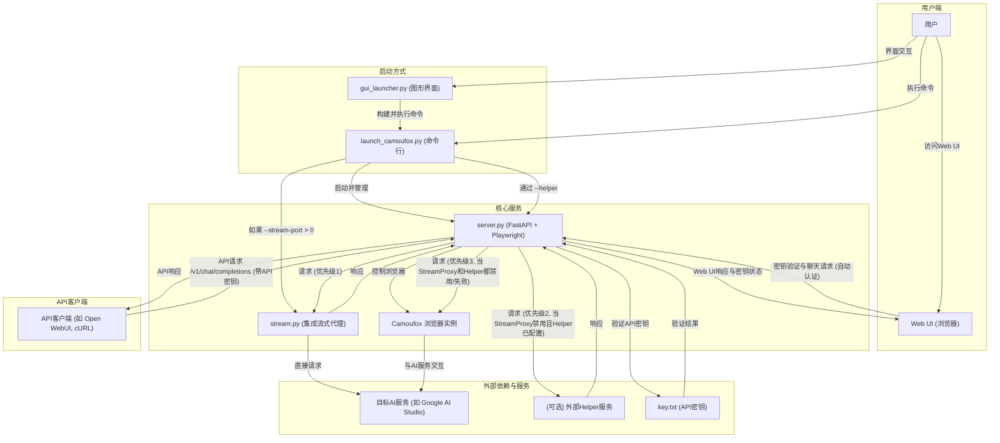

# AI Studio 代理 API (Python 版本)

这是一个基于 Python 的代理服务器，用于将 Google AI Studio 的网页界面转换为 OpenAI 兼容的 API。通过 Camoufox (反指纹检测的 Firefox) 和 Playwright 自动化，提供稳定的 API 访问。

## 主要特性

*   **OpenAI 兼容 API**: 支持 `/v1/chat/completions` 端点，兼容现有的 OpenAI 客户端
*   **流式和非流式响应**: 支持实时流式输出和传统的完整响应
*   **模型切换**: 通过 API 请求中的 `model` 字段动态切换 AI Studio 中的模型
*   **参数控制**: 支持 `temperature`, `max_output_tokens`, `top_p`, `stop` 等参数
*   **反指纹检测**: 使用 Camoufox 降低被检测为自动化脚本的风险
*   **多种响应获取方式**: 集成流式代理、外部 Helper 服务、Playwright 页面交互
*   **Web UI**: 内置现代化的测试界面，支持聊天、状态监控、API密钥管理
*   **图形界面启动器**: 提供 GUI 启动器，简化配置和管理

## 系统架构

## 使用教程

推荐使用 [`gui_launcher.py`](gui_launcher.py) (图形界面) 或直接使用 [`launch_camoufox.py`](launch_camoufox.py) (命令行) 进行日常运行。仅在首次设置或认证过期时才需要使用调试模式。

### 快速开始

1. **安装**: 参见 [安装指南](docs/installation-guide.md)
2. **首次认证**: 参见 [认证设置指南](docs/authentication-setup.md)  
3. **日常运行**: 参见 [日常运行指南](docs/daily-usage.md)
4. **API使用**: 参见 [API使用指南](docs/api-usage.md)
5. **Web界面**: 参见 [Web UI使用指南](docs/webui-guide.md)

### 详细文档

- [安装指南](docs/installation-guide.md) - 详细的安装步骤和环境配置
- [认证设置指南](docs/authentication-setup.md) - 首次运行与认证文件设置
- [日常运行指南](docs/daily-usage.md) - 日常使用和配置选项
- [API使用指南](docs/api-usage.md) - API端点和客户端配置
- [Web UI使用指南](docs/webui-guide.md) - Web界面功能说明
- [故障排除指南](docs/troubleshooting.md) - 常见问题解决方案
- [高级配置指南](docs/advanced-configuration.md) - 高级功能和配置选项
- [日志控制指南](docs/logging-control.md) - 日志系统配置和调试

## 客户端配置示例

以 Open WebUI 为例：

1. 打开 Open WebUI
2. 进入 "设置" -> "连接"
3. 在 "模型" 部分，点击 "添加模型"
4. **模型名称**: 输入你想要的名字，例如 `aistudio-gemini-py`
5. **API 基础 URL**: 输入 `http://127.0.0.1:2048/v1`
6. **API 密钥**: 留空或输入任意字符
7. 保存设置并开始聊天

---

## Docker 部署

本项目支持通过 Docker 进行部署。详细的构建和运行说明，请参阅：

- [Docker 部署指南 (README-Docker.md)](README-Docker.md)

请注意，首次运行获取认证文件目前不能在docker环境完成，必须在主机完成，因此docker方式安装当前仅仅是为了方便云端部署项目。在主机部署本项目成功取得json认证文件后，日常运行通过挂载json可以使用docker来运行本项目。

---

## 关于 Camoufox

本项目使用 [Camoufox](https://camoufox.com/) 来提供具有增强反指纹检测能力的浏览器实例。

*   **核心目标**: 模拟真实用户流量，避免被网站识别为自动化脚本或机器人
*   **实现方式**: Camoufox 基于 Firefox，通过修改浏览器底层 C++ 实现来伪装设备指纹（如屏幕、操作系统、WebGL、字体等），而不是通过容易被检测到的 JavaScript 注入
*   **Playwright 兼容**: Camoufox 提供了与 Playwright 兼容的接口
*   **Python 接口**: Camoufox 提供了 Python 包，可以通过 `camoufox.server.launch_server()` 启动其服务，并通过 WebSocket 连接进行控制

使用 Camoufox 的主要目的是提高与 AI Studio 网页交互时的隐蔽性，减少被检测或限制的可能性。但请注意，没有任何反指纹技术是绝对完美的。

## 重要提示

### 响应获取与参数控制

*   **响应获取优先级**: 项目采用多层响应获取机制：
    1. **集成的流式代理服务**: 默认启用，提供最佳性能
    2. **外部 Helper 服务**: 可选配置
    3. **Playwright 页面交互**: 后备方案

*   **参数控制**: API 请求中的模型参数（如 `temperature`, `max_output_tokens`, `top_p`, `stop`）**仅在通过 Playwright 页面交互获取响应时生效**。使用集成流式代理或外部 Helper 服务时，参数传递取决于这些服务的实现。

### 客户端管理历史

**客户端管理历史，代理不支持 UI 内编辑**: 客户端负责维护完整的聊天记录并将其发送给代理。代理服务器本身不支持在 AI Studio 界面中对历史消息进行编辑或分叉操作。

## 未来计划

以下是一些计划中的改进方向：

*   **云服务器部署指南**: 提供更详细的在主流云平台上部署和管理服务的指南
*   **认证更新流程优化**: 探索更便捷的认证文件更新机制，减少手动操作
*   **流程健壮性优化**: 减少错误几率和接近原生体验

## 贡献

欢迎提交 Issue 和 Pull Request！

## License

[AGPLv3](LICENSE)

## 开发不易，支持作者

如果您觉得本项目对您有帮助，并且希望支持作者的持续开发，欢迎通过以下方式进行捐赠。您的支持是对我们最大的鼓励！

