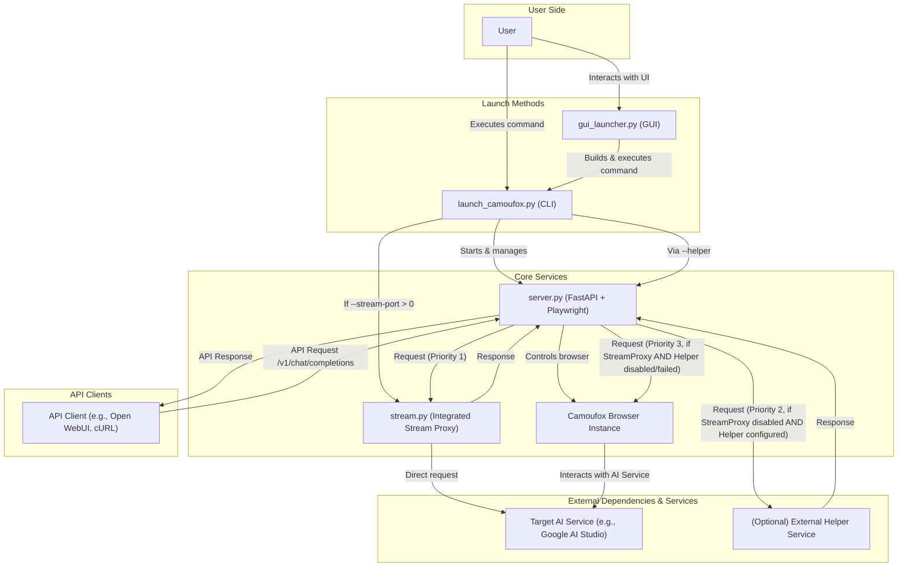

# AI Studio Proxy Server (Python/Camoufox Version)

[](https://www.star-history.com/#CJackHwang/AIstudioProxyAPI&Date)

This project is generously sponsored by ZMTO. Visit their website: [https://zmto.com/](https://zmto.com/)

本项目由 ZMTO 慷慨赞助服务器支持。访问他们的网站：[https://zmto.com/](https://zmto.com/)

---

**⚠️ 重要提示：`start.py` 脚本已弃用！**

为了获得更好的启动体验和兼容性，强烈推荐使用以下任一启动器：
*   **图形界面启动器**: [`gui_launcher.py`](gui_launcher.py:1)
*   **命令行启动器**: [`launch_camoufox.py`](launch_camoufox.py:1)

您可以在下方的“使用教程”部分找到详细的启动和运行指南。

---

## 致谢 (Acknowledgements)

本项目的诞生与发展，离不开以下个人、组织和社区的慷慨支持与智慧贡献：

*   **项目发起与主要开发**: @CJackHwang ([https://github.com/CJackHwang](https://github.com/CJackHwang))
*   **重要贡献与功能完善、win系统调试**: @ayuayue ([https://github.com/ayuayue](https://github.com/ayuayue))
*   **实时流式功能优化与完善**: @luispater ([https://github.com/luispater](https://github.com/luispater))
*   **社区支持与灵感碰撞**: 特别感谢 [Linux.do 社区](https://linux.do/) 成员们的热烈讨论、宝贵建议和问题反馈，你们的参与是项目前进的重要动力。

同时，我们衷心感谢所有通过提交 Issue、提供建议、分享使用体验、贡献代码修复等方式为本项目默默奉献的每一位朋友。是你们共同的努力，让这个项目变得更好！

---

**这是当前维护的 Python 版本。不再维护的 Javascript 版本请参见 [`deprecated_javascript_version/README.md`](deprecated_javascript_version/README.md)。**

---

## 目录

*   [AI Studio Proxy Server (Python/Camoufox Version)](#ai-studio-proxy-server-pythoncamoufox-version)
*   [致谢 (Acknowledgements)](#致谢-acknowledgements)
*   [项目概述](#项目概述)
*   [工作原理](#工作原理)
*   [免责声明](#免责声明)
*   [核心特性 (Python 版本)](#核心特性-python-版本)
*   [重要提示 (Python 版本)](#重要提示-python-版本)
*   [项目运行流程图](#项目运行流程图)
*   [使用教程](#使用教程)
    *   [1. 先决条件](#1-先决条件)
    *   [2. 安装](#2-安装)
    *   [3. 首次运行与认证 (关键!)](#3-首次运行与认证-关键)
        *   [3.1 安装和信任根证书 (用于实时流式服务)](#31-安装和信任根证书-用于实时流式服务)
    *   [4. 日常运行](#4-日常运行)
    *   [使用图形界面启动器 `gui_launcher.py`](#使用图形界面启动器-gui_launcherpy)
    *   [5. API 使用](#5-api-使用)
    *   [6. Web UI (服务测试)](#6-web-ui-服务测试)
    *   [7. 配置客户端 (以 Open WebUI 为例)](#7-配置客户端-以-open-webui-为例)
*   [Docker 部署](#docker-部署)
*   [多平台指南 (Python 版本)](#多平台指南-python-版本)
*   [故障排除 (Python 版本)](#故障排除-python-版本)
    *   [流式代理服务：工作原理与手动证书生成](#流式代理服务工作原理与手动证书生成)
*   [关于 Camoufox](#关于-camoufox)
*   [关于 `fetch_camoufox_data.py`](#关于-fetch_camoufox_datapy)
*   [控制日志输出 (Python 版本)](#控制日志输出-python-版本)
*   [未来计划 / Roadmap](#未来计划-roadmap)
*   [贡献](#贡献)
*   [License](#license)
*   [开发不易，支持作者](#开发不易支持作者)
---

## 项目概述

这是一个基于 **Python + FastAPI + Playwright + Camoufox** 的代理服务器，旨在通过模拟 OpenAI API 的方式间接访问 Google AI Studio 网页版。

项目核心优势在于结合了：

*   **FastAPI**: 提供高性能、兼容 OpenAI 标准的 API 接口，现已支持模型参数传递和动态模型切换。
*   **Playwright**: 强大的浏览器自动化库，用于与 AI Studio 页面交互。
*   **Camoufox**: 一个经过修改和优化的 Firefox 浏览器，专注于**反指纹检测和反机器人探测**。它通过底层修改而非 JS 注入来伪装浏览器指纹，旨在模拟真实用户流量，提高自动化操作的隐蔽性和成功率。
*   **请求队列**: 保证请求按顺序处理，提高稳定性。

通过此代理，支持 OpenAI API 的各种客户端（如 Open WebUI, LobeChat, NextChat 等）可以连接并使用 Google AI Studio 的模型。
## 工作原理

本项目作为一个智能代理层，核心目标是允许用户通过标准的 OpenAI API 格式与 Google AI Studio 进行交互。其工作流程和关键组件如下：

1.  **API 兼容层 ([`server.py`](server.py:1) 与 FastAPI)**:
    *   使用 FastAPI 构建了一个与 OpenAI API 规范兼容的 HTTP 服务器。这使得各种现有的 OpenAI 客户端（如聊天界面、开发库等）可以直接连接到本代理。
    *   负责接收来自客户端的请求（例如 `/v1/chat/completions`），解析参数，并将任务分发给后端处理模块。

2.  **浏览器自动化 ([`server.py`](server.py:1) 与 Playwright)**:
    *   当需要与 Google AI Studio 网页直接交互时（例如，在没有更优的响应获取方式时，或进行参数设置、模型切换等操作），项目利用 Playwright 库。
    *   Playwright 能够以编程方式控制浏览器，模拟用户在 AI Studio 页面上的操作，如输入文本、点击按钮、读取页面内容等。

3.  **增强型浏览器 (Camoufox)**:
    *   为了提高自动化操作的隐蔽性并减少被目标网站检测为机器人的风险，本项目集成了 Camoufox。
    *   Camoufox 是一个经过修改的 Firefox 浏览器，专注于通过底层修改来伪装浏览器指纹（如 User-Agent、屏幕分辨率、WebGL 指纹等），而非依赖容易被检测的 JavaScript 注入。这有助于模拟更真实的浏览器环境。
    *   [`launch_camoufox.py`](launch_camoufox.py:1) 负责启动和管理 Camoufox 实例。

4.  **集成的流式代理服务 ([`stream/main.py`](stream/main.py:1) 与 [`server.py`](server.py:1) 子进程)**:
    *   这是项目推荐的、性能更优的响应获取方式，默认监听在端口 `3120`。
    *   **HTTPS 拦截与动态证书生成**:
        *   此服务扮演一个中间人代理 (Man-in-the-Middle Proxy) 的角色，能够拦截发往特定域名（如 Google 相关服务）的 HTTPS 请求。
        *   为了解密和处理 HTTPS 流量，它使用一个自签名的根 CA 证书 ([`certs/ca.crt`](certs/ca.crt:1))。当首次拦截到一个新的 HTTPS 主机时，它会动态地为该主机生成一个服务器证书，并用此 CA 进行签名。
        *   用户需要将项目提供的 `certs/ca.crt` 安装并信任到其操作系统或浏览器中，才能使此功能正常工作并避免安全警告。相关的证书安装指南请参见 [安装和信任根证书](#31-安装和信任根证书-用于实时流式服务)。
    *   **响应转换**: 拦截到来自 Google AI Studio 的响应后，此服务会将其解析并转换为 OpenAI API 所期望的流式或非流式格式，然后返回给 [`server.py`](server.py:1)，最终传递给 API 客户端。
    *   如果用户需要手动重新生成项目使用的根 CA 证书，详细命令位于本文档的 [故障排除 -> 流式代理服务：工作原理与手动证书生成 -> 证书生成](#证书生成) 小节。

5.  **请求处理与响应获取优先级**:
    *   项目采用多层机制获取响应，优先级如下：
        1.  **集成的流式代理服务**: 性能最佳，直接处理。
        2.  **(可选) 外部 Helper 服务**: 如果配置，作为次级选择。
        3.  **Playwright 页面交互**: 作为后备方案，直接通过 Camoufox 与 AI Studio 网页交互。
    *   详细的请求处理流程和组件交互可以参考 [项目运行流程图](#项目运行流程图)。

通过这些组件的协同工作，本项目实现了将 Google AI Studio 的能力封装在 OpenAI 兼容的 API 之后，为用户提供了便捷的访问方式。

---

## 免责声明

使用本项目即表示您已完整阅读、理解并同意本免责声明的全部内容。
本项目通过自动化脚本（Playwright + Camoufox）与 Google AI Studio 网页版进行交互。这种自动化访问网页的方式可能违反 Google AI Studio 或相关 Google 服务的用户协议或服务条款（Terms of Service）。不当使用本项目可能导致您的 Google 账号受到警告、功能限制、暂时或永久封禁等处罚。项目作者及贡献者对此不承担任何责任。
由于本项目依赖于 Google AI Studio 网页的结构和前端代码，Google 随时可能更新或修改其网页，这可能导致本项目的功能失效、不稳定或出现未知错误。项目作者及贡献者无法保证本项目的持续可用性或稳定性。
本项目并非 Google 或 OpenAI 的官方项目或合作项目。它是一个完全独立的第三方工具。项目作者与 Google 和 OpenAI 没有任何关联。
本项目按"现状"（AS IS）提供，不提供任何明示或暗示的保证，包括但不限于适销性、特定用途的适用性及不侵权的保证。您理解并同意自行承担使用本项目可能带来的所有风险。
在任何情况下，项目作者或贡献者均不对因使用或无法使用本项目而产生的任何直接、间接、附带、特殊、惩罚性或后果性的损害承担责任。
使用本项目，即视为您已完全理解并接受本免责声明的全部条款。如果您不同意本声明的任何内容，请立即停止使用本项目。

## 核心特性 (Python 版本)

*   **OpenAI API 兼容**: 提供 `/v1/chat/completions`, `/v1/models`, `/api/info`, `/health`, `/v1/queue`, `/v1/cancel/{req_id}` 端点 (默认端口 `2048`)。现在支持在 `/v1/chat/completions` 请求中传递模型参数（如 `temperature`, `max_output_tokens`, `top_p`, `stop`），代理会尝试在 AI Studio 页面上应用这些参数。
*   **模型切换**: API 请求中的 `model` 字段现在用于在 AI Studio 页面动态切换模型。
*   **流式/非流式响应**: 支持 `stream=true` 和 `stream=false`。
*   **响应获取优先级**:
    1.  **集成的流式代理服务 (Stream Proxy Service)**: 默认启用 (监听在 `3120` 端口)。此服务直接处理流式和非流式请求，通常提供最佳性能和稳定性。可以通过 [`launch_camoufox.py`](launch_camoufox.py:1) 的 `--stream-port=0` 参数禁用。
    2.  **外部 Helper 服务 (可选)**: 如果配置了 `HELPER_ENDPOINT` 和 `HELPER_SAPISID` 环境变量 (或通过 [`launch_camoufox.py`](launch_camoufox.py:1) 的 `--helper` 参数设置端点，并有有效认证文件提供 `SAPISID`)，且集成的流式代理服务被禁用，则会尝试使用此外部服务获取响应。
    3.  **Playwright 页面交互 (后备)**: 如果上述两种方法均不可用，[`server.py`](server.py:1) 将通过 Playwright 控制 Camoufox 浏览器直接与 Google AI Studio 网页交互，模拟用户操作来获取响应。
*   **请求队列**: 使用 `asyncio.Queue` 顺序处理请求，提高稳定性。
*   **Camoufox 集成**: 通过 [`launch_camoufox.py`](launch_camoufox.py:1) 调用 `camoufox` 库启动修改版的 Firefox 实例，利用其反指纹和反检测能力。
*   **多种启动模式**:
    *   **调试模式 (`--debug`)**: 启动一个带界面的浏览器，用于首次认证、调试和更新认证文件。支持保存和加载浏览器认证状态 (`auth_profiles` 目录) 实现免登录。
    *   **无头模式 (`--headless`)**: 在后台以无界面方式运行，需要预先保存的有效认证文件。
    *   **虚拟显示无头模式 (`--virtual-display`)**: 仅限 Linux，使用 Xvfb 虚拟显示器运行无头浏览器。
*   **认证管理**: 强调 `auth_profiles/active/` 下的 `.json` 认证文件对无头模式的重要性，以及通过 `--debug` 模式更新认证的方法。
*   **系统提示词与历史记录**: 支持 `messages` 中的 `system` 角色和多轮对话历史。
*   **自动清空上下文 (条件性)**: 尝试在新对话开始时，如果当前不在 `/new_chat` 页面，则自动清空 AI Studio 页面的聊天记录。
*   **智能响应获取 (后备机制)**: 当集成的流式代理和外部 Helper 服务均不可用时，优先尝试通过模拟点击"编辑"或"复制"按钮获取原生响应，提高响应内容的准确性。
*   **Web UI**: 提供 `/` 路径访问一个基于 `index.html` 的现代聊天界面，包含：
    *   聊天视图。
    *   服务器信息视图 (API 信息、健康检查状态，支持刷新)。
    *   模型参数设置面板 (可调系统提示词、温度、最大Token、Top-P、停止序列，并保存设置至浏览器本地存储)。
    *   实时系统日志侧边栏 (通过 WebSocket)。
    *   亮色/暗色主题切换与本地存储。
    *   响应式设计，适配不同屏幕尺寸。
    *   默认系统提示词示例 (Web UI 中，可配置)。
*   **服务端 (`server.py`)**: FastAPI 应用，处理 API 请求，通过 Playwright 控制 Camoufox 浏览器与 AI Studio 交互。
*   **启动器 (`launch_camoufox.py`)**: 负责协调启动 Camoufox 服务（通过内部调用自身）和 FastAPI 服务，并管理它们之间的连接。通常由 [`gui_launcher.py`](gui_launcher.py:1) 在后台调用。
*   **图形界面启动器 (`gui_launcher.py`)**: 提供一个 Tkinter GUI，简化 [`launch_camoufox.py`](launch_camoufox.py:1) 的启动和管理，包括有头/无头模式选择、端口管理、代理配置和日志显示。
*   **错误快照**: 出错时自动在 `errors_py/` 目录保存截图和 HTML。
*   **日志控制**: 可通过环境变量控制 [`server.py`](server.py:1) 的日志级别和 `print` 输出重定向行为。
*   **WebSocket 实时日志**: 提供 `/ws/logs` 端点，Web UI 通过此接口显示后端日志。
*   **辅助端点**: 提供 `/health`, `/v1/queue`, `/v1/cancel/{req_id}` 等端点用于监控和管理。
*   **集成的流式代理服务**: [`server.py`](server.py:1) 现在内置一个流式代理子进程 (基于 [`stream/main.py`](stream/main.py:1))，默认监听在端口 `3120`。此服务负责直接与目标 AI 服务通信，获取流式或非流式响应，并将结果传递回 [`server.py`](server.py:1)。可通过 [`launch_camoufox.py`](launch_camoufox.py:1) 的 `--stream-port` 参数配置其端口或禁用 (设置为0)。
*   **外部 Helper 服务支持 (作为次级后备)**: 仍然支持通过配置 `HELPER_ENDPOINT` 和 `HELPER_SAPISID` (或通过 [`launch_camoufox.py`](launch_camoufox.py:1) 的 `--helper` 参数和认证文件) 来使用外部 Helper 服务获取响应。这现在是第二优先级的响应获取方式。

## 重要提示 (Python 版本)

*   **非官方项目**: 依赖 AI Studio Web 界面，可能因页面更新失效。
*   **认证文件是关键**: 无头模式 (通过 [`launch_camoufox.py`](launch_camoufox.py:1) 或 [`gui_launcher.py`](gui_launcher.py:1) 启动) **高度依赖**于 `auth_profiles/active/` 下有效的 `.json` 认证文件。**文件可能会过期**，需要定期通过 [`launch_camoufox.py --debug`](launch_camoufox.py:1) 模式手动运行、登录并保存新的认证文件来替换更新。
*   **响应获取与参数控制**:
    *   **响应获取优先级**: 项目现在采用多层响应获取机制：
        1.  **集成的流式代理服务 (Stream Proxy)**: 默认通过 [`launch_camoufox.py`](launch_camoufox.py:1) 启动时启用，监听在端口 `3120` (可通过 `--stream-port` 修改或设为 `0` 禁用)。此服务直接处理请求，提供最佳性能。
        2.  **外部 Helper 服务**: 如果集成的流式代理被禁用，且通过 [`launch_camoufox.py`](launch_camoufox.py:1) 的 `--helper <endpoint_url>` 参数提供了 Helper 服务端点，并且存在有效的认证文件 (`auth_profiles/active/*.json`，用于提取 `SAPISID` Cookie)，则会尝试使用此外部 Helper 服务。
        3.  **Playwright 页面交互**: 如果以上两种方法均未启用或失败，则回退到传统的 Playwright 方式，通过模拟浏览器操作（编辑/复制按钮）获取响应。
    *   API 请求中的 `model` 字段用于在 AI Studio 页面切换模型。请确保模型 ID 有效。
    *   API 请求中的模型参数（如 `temperature`, `max_output_tokens`, `top_p`, `stop`）会被代理接收并尝试在 AI Studio 页面应用。这些参数的设置**仅在通过 Playwright 页面交互获取响应时生效**。当使用集成的流式代理或外部 Helper 服务时，这些参数的传递和应用方式取决于这些服务自身的实现，可能与 AI Studio 页面的设置不同步或不完全支持。
    *   Web UI 的"模型设置"面板的参数配置也主要影响通过 Playwright 页面交互获取响应的场景。
    *   项目根目录下的 [`excluded_models.txt`](excluded_models.txt:1) 文件可用于从 `/v1/models` 端点返回的列表中排除特定的模型 ID。
*   **CSS 选择器依赖**: 页面交互（如获取响应、清空聊天、设置参数等）依赖 [`server.py`](server.py:1) 中定义的 CSS 选择器。AI Studio 页面更新可能导致这些选择器失效，需要手动更新。此依赖主要影响上述第三种响应获取方式 (Playwright 页面交互)。
*   **Camoufox 特性**: 利用 Camoufox 增强反指纹能力。了解更多信息请参考 [Camoufox 官方文档](https://camoufox.com/)。
*   **稳定性**: 浏览器自动化本质上不如原生 API 稳定，长时间运行可能需要重启。
*   **AI Studio 限制**: 无法绕过 AI Studio 本身的速率、内容等限制。
*   **端口号**: FastAPI 服务默认端口为 `2048`。集成的流式代理服务默认端口为 `3120`。这些都可以在 [`launch_camoufox.py`](launch_camoufox.py:1) 中通过参数 (`--server-port`, `--stream-port`) 修改。
*   **客户端管理历史，代理不支持 UI 内编辑**: 客户端负责维护完整的聊天记录并将其发送给代理。代理服务器本身不支持在 AI Studio 界面中对历史消息进行编辑或分叉操作；它总是处理客户端发送的完整消息列表，然后将其发送到 AI Studio 页面。

## 项目运行流程图



## 使用教程

推荐使用 [`gui_launcher.py`](gui_launcher.py:1) (图形界面) 或直接使用 [`launch_camoufox.py`](launch_camoufox.py:1) (命令行) 进行日常运行。仅在首次设置或认证过期时才需要使用 [`launch_camoufox.py --debug`](launch_camoufox.py:1) 或 [`gui_launcher.py`](gui_launcher.py:1) 的有头模式。

### 1. 先决条件

*   **Python**: 3.8 或更高版本 (建议 3.9+)。
*   **pip**: Python 包管理器。
*   **(可选但推荐) Git**: 用于克隆仓库。
*   **Google AI Studio 账号**: 并能正常访问和使用。

### 2. 安装

1.  **克隆仓库**:
    ```bash
    git clone https://github.com/CJackHwang/AIstudioProxyAPI
    cd AIstudioProxyAPI
    ```

2.  **(推荐) 创建并激活虚拟环境**:
    ```bash
    python -m venv venv
    source venv/bin/activate  # Linux/macOS
    # venv\\Scripts\\activate  # Windows
    ```

    *   说明: 第一行命令 `python -m venv venv` 会在当前目录下创建一个名为 `venv` 的子目录，里面包含了 Python 解释器和独立的包安装目录。第二行命令 `source venv/bin/activate` (macOS/Linux) 或 `venv\\Scripts\\activate` (Windows) 会激活这个环境，之后你的终端提示符可能会发生变化 (例如前面加上 `(venv)` )，表示你正处于虚拟环境中。后续的 `pip install` 命令会将库安装到这个 `venv` 目录内。

3.  **安装 Camoufox 和依赖**:
    ```bash
    # 安装 Camoufox 库 (推荐包含 geoip 数据，特别是使用代理时)
    pip install -U camoufox[geoip]

    # 安装项目所需的其他 Python 库
    pip install -r requirements.txt
    ```
    `requirements.txt` 主要包含 `fastapi`, `uvicorn[standard]`, `playwright`, `pydantic`。

4.  **下载 Camoufox 浏览器**:
    ```bash
    # Camoufox 需要下载其修改版的 Firefox
    camoufox fetch
    ```
    如果此步骤因 SSL 证书等网络问题失败，可以尝试运行项目中的 [`fetch_camoufox_data.py`](fetch_camoufox_data.py:1) 脚本 (详见[下方说明](#关于-fetch_camoufox_datapy))。

5.  **安装 Playwright 浏览器依赖 (如果需要)**:
    虽然 Camoufox 使用自己的 Firefox，但首次运行 Playwright 相关命令可能仍需要安装一些基础依赖。
    ```bash
    # 确保 Playwright 库能找到必要的系统依赖
    playwright install-deps firefox
    # 或者 playwright install-deps # 安装所有浏览器的依赖
    ```

### 3. 首次运行与认证 (关键!)

为了避免每次启动都手动登录 AI Studio，你需要先通过 [`launch_camoufox.py --debug`](launch_camoufox.py:1) 模式或 [`gui_launcher.py`](gui_launcher.py:1) 的有头模式运行一次来生成认证文件。

1.  **通过命令行运行 Debug 模式**:
    ```bash
    python launch_camoufox.py --debug --server-port 2048 --stream-port 3120 --helper '' --internal-camoufox-proxy ''
    ```
    *   **重要:**
        *   使用 `--server-port <端口号>` (例如 2048) 指定 FastAPI 服务器监听的端口。
        *   使用 `--stream-port <端口号>` (例如 3120) 来启动集成的流式代理服务。如果希望禁用此服务 (例如，优先使用外部 Helper 或仅依赖 Playwright 交互)，请设置为 `--stream-port 0`。
        *   使用 `--helper <端点URL>` (例如 `--helper http://my.helper.service/api`) 来指定外部 Helper 服务的地址。如果不想使用外部 Helper，可以省略此参数或设置为空字符串 (`--helper ''`)。
        *   **使用 `--internal-camoufox-proxy <代理地址>` (例如 `--internal-camoufox-proxy http://127.0.0.1:7890`) 来为 Camoufox 浏览器和流式服务器指定代理。如果不需要代理，请设置为 `--internal-camoufox-proxy ''`。如果需要启用实时流式，必须设置此参数保证运行正常**
    *   脚本会启动 Camoufox（通过内部调用自身），并在终端输出启动信息。
    *   你会看到一个 **带界面的 Firefox 浏览器窗口** 弹出。
    *   **关键交互:** **在弹出的浏览器窗口中完成 Google 登录**，直到看到 AI Studio 聊天界面。 (脚本会自动处理浏览器连接，无需用户手动操作)。
    *   回到终端，提示保存认证时输入 `y` 并回车 (文件名可默认)。文件会保存在 `auth_profiles/saved/`。
    *   **将 `auth_profiles/saved/` 下新生成的 `.json` 文件移动到 `auth_profiles/active/` 目录。** 确保 `active` 目录下只有一个 `.json` 文件。
    *   可以按 `Ctrl+C` 停止 `--debug` 模式的运行。

2.  **通过 GUI 启动有头模式**:
    *   运行 `python gui_launcher.py`。
    *   在 GUI 中输入 `FastAPI 服务端口` (默认为 2048)。
    *   点击 `启动有头模式` 按钮。
    *   在弹出的新控制台和浏览器窗口中，按照命令行方式的提示进行 Google 登录和认证文件保存操作。
    *   同样需要手动将认证文件从 `auth_profiles/saved/` 移动到 `auth_profiles/active/`。

3.  **激活认证文件**:
    *   进入 `auth_profiles/saved/` 目录，找到刚才保存的 `.json` 认证文件。
    *   将这个 `.json` 文件 **移动或复制** 到 `auth_profiles/active/` 目录下。
    *   **重要:** 确保 `auth_profiles/active/` 目录下 **有且仅有一个 `.json` 文件**。无头模式启动时会自动加载此目录下的第一个 `.json` 文件。

**认证文件会过期!** Google 的登录状态不是永久有效的。当无头模式启动失败并报告认证错误或重定向到登录页时，意味着 `active` 目录下的认证文件已失效。你需要：

1.  删除 `active` 目录下的旧文件。
2.  重新执行上面的 **【通过命令行运行 Debug 模式】** 或 **【通过 GUI 启动有头模式】** 步骤，生成新的认证文件。
3.  将新生成的 `.json` 文件再次移动到 `active` 目录下。

#### 3.1 安装和信任根证书 (用于实时流式服务)

为了确保实时流式服务 (通过端口 `3120` 或自定义的 `--stream-port` 提供的服务) 能够正常工作，特别是当您在浏览器或其他客户端中直接访问此服务的 HTTPS 端点时，您需要安装并信任项目提供的根证书 `certs/ca.crt`。如果不信任此证书，浏览器或客户端可能会报告安全警告，并拒绝连接。

**重要提示**:
*   此证书由项目在首次运行时自动生成 (通过 [`stream/cert_manager.py`](stream/cert_manager.py:1))，用于加密代理服务器与您的客户端之间的本地通信。
*   信任此证书仅用于本地开发和测试目的。请勿在生产环境中使用自签名证书。
*   文件路径: `certs/ca.crt` (相对于项目根目录)

**Windows 系统:**

1.  **打开证书管理器**:
    *   按 `Win + R` 打开“运行”对话框，输入 `certmgr.msc` 并按回车。
2.  **导入证书**:
    *   在左侧导航栏中，右键点击“受信任的根证书颁发机构” -> “所有任务” -> “导入...”。
    *   点击“下一步”。
    *   点击“浏览...”，导航到项目目录下的 `certs/` 文件夹，选择 `ca.crt` 文件。 (确保文件类型选择为 "所有文件 (\*.\*)" 或 "PKCS \#7 证书 (\*.spc; \*.p7b)" 或 "X.509 证书 (\*.cer; \*.crt; \*.der; \*.pem; \*.pfx; \*.p12)" 才能看到 `.pem` 文件)。
    *   点击“打开”，然后点击“下一步”。
    *   确保“证书存储”选择的是“受信任的根证书颁发机构”。
    *   点击“下一步”，然后点击“完成”。
    *   如果出现安全警告，请选择“是”。
3.  **验证**:
    *   在“受信任的根证书颁发机构” -> “证书”中，您应该能找到名为 "AI Studio Proxy CA" (或类似名称) 的证书。

**macOS 系统:**

1.  **打开钥匙串访问 (Keychain Access)**:
    *   通过 Spotlight 搜索 (Cmd + Space) 输入 "Keychain Access" 并打开它。
2.  **导入证书**:
    *   在左上角的“钥匙串”列表中，选择“系统”。
    *   将 `certs/ca.crt` 文件拖拽到右侧的证书列表中。
    *   或者，选择菜单栏的“文件” -> “导入项目...”，然后选择 `certs/ca.crt` 文件。
3.  **信任证书**:
    *   在证书列表中找到刚刚导入的证书 (通常以 "AI Studio Proxy CA" 或类似名称显示)。
    *   双击该证书，展开“信任”部分。
    *   在“使用此证书时:”下拉菜单中，选择“始终信任”。
    *   关闭证书信息窗口，系统可能会要求您输入管理员密码以保存更改。
4.  **验证**:
    *   证书图标应该不再显示红色的 "x" 标记。

**Linux 系统 (以 Ubuntu/Debian 为例):**

1.  **复制证书文件**:
    首先，将您的根证书文件 (`ca.crt`) 复制到系统证书目录中。通常，这是 `/usr/local/share/ca-certificates/`。您可能需要先创建该目录。
    ```bash
    sudo mkdir -p /usr/local/share/ca-certificates/
    sudo cp certs/ca.crt /usr/local/share/ca-certificates/aistudio_proxy_ca.crt
    ```
    *(注意: 将 `certs/ca.crt` 替换为您的实际证书文件路径，并将 `aistudio_proxy_ca.crt` 替换为您希望在系统中显示的证书文件名。)*

2.  **更新证书存储**:
    ```bash
    sudo update-ca-certificates
    ```
    您应该会看到类似 "1 added, 0 removed; done." (如果之前没有此证书) 或 "1 added, 1 removed; done." (如果更新了同名证书) 的输出。
2.  **验证 (可选)**:
    *   检查 `/etc/ssl/certs` 目录中是否包含指向新证书的符号链接。

完成以上步骤后，您的系统和浏览器应该会信任由 `certs/ca.crt` 签发的本地 HTTPS 服务证书，从而避免安全警告并确保实时流式服务正常连接。如果遇到问题，请尝试重启浏览器或计算机。

*   **首次访问新主机的性能问题**: 当通过流式代理首次访问一个新的 HTTPS 主机时，服务需要为该主机动态生成并签署一个新的子证书。这个过程可能会比较耗时，导致对该新主机的首次连接请求响应较慢，甚至在某些情况下可能被主程序（如 [`server.py`](server.py:1) 中的 Playwright 交互逻辑）误判为浏览器加载超时。一旦证书生成并缓存后，后续访问同一主机将会显著加快。

### 4. 日常运行

完成首次认证设置后，推荐使用 [`gui_launcher.py`](gui_launcher.py:1) 的无头模式或直接通过命令行运行 [`launch_camoufox.py --headless`](launch_camoufox.py:1) 进行日常运行。

**启动器 (`launch_camoufox.py`) 说明:**

在需要进行配置、测试、调试或更新认证文件时，或者当您偏好命令行操作并需要细致控制启动参数时，**推荐优先直接使用 [`launch_camoufox.py`](launch_camoufox.py:1) 脚本启动**。这是项目的基础启动方式，提供了更详细的控制和日志输出。

*   [`launch_camoufox.py`](launch_camoufox.py:1) 支持通过命令行参数 (`--headless` 或 `--debug` 或 `--virtual-display`) 来启动有头（带界面）或无头模式。
*   它还支持通过 `--server-port` (FastAPI服务端口, 默认 2048), `--stream-port` (集成流式代理端口, 默认 3120, 设为 0 禁用), `--helper <url>` (外部Helper服务URL, 默认为空即禁用) **和 `--internal-camoufox-proxy <代理地址>` (用于指定浏览器代理，例如 `http://127.0.0.1:7890`)** 参数来精细控制服务端口、响应获取方式和浏览器代理。
*   使用 [`launch_camoufox.py --debug`](launch_camoufox.py:1) 是生成和更新认证文件的**唯一方式**（或者通过 GUI 的有头模式间接调用）。
*   通过直接运行 [`launch_camoufox.py`](launch_camoufox.py:1)，你可以更清晰地看到内部 Camoufox 启动、FastAPI 服务器及集成流式代理的启动过程和日志，方便排查初始设置问题。

**配置响应获取模式示例 (使用 [`launch_camoufox.py`](launch_camoufox.py:1)):**

*   **模式1: 优先使用集成的流式代理 (默认推荐)**
    ```bash
    # FastAPI 在 2048, 集成流式代理在 3120, 不使用外部 Helper, 明确不使用浏览器代理
    python launch_camoufox.py --server-port 2048 --stream-port 3120 --helper '' --internal-camoufox-proxy ''
    # 如果希望流式代理使用其他端口，例如 3125:
    # python launch_camoufox.py --server-port 2048 --stream-port 3125 --helper '' --internal-camoufox-proxy ''
    # 如果需要指定浏览器代理，例如 http://127.0.0.1:7890:
    # python launch_camoufox.py --server-port 2048 --stream-port 3120 --helper '' --internal-camoufox-proxy 'http://127.0.0.1:7890'
    ```
    在此模式下，[`server.py`](server.py:1) 会优先尝试通过端口 `3120` (或指定的 `--stream-port`) 上的集成流式代理获取响应。如果失败，则回退到 Playwright 页面交互。
    **重要提示**: 当 `--stream-port` 大于 `0` (即启用流式代理) 时，强烈建议同时通过 `--internal-camoufox-proxy` 参数为 Camoufox 浏览器指定代理地址，以确保流式代理能够正常工作。如果不需要浏览器代理，也请明确设置为 `--internal-camoufox-proxy ''`。

*   **模式2: 优先使用外部 Helper 服务 (禁用集成流式代理)**
    ```bash
    # FastAPI 在 2048, 禁用集成流式代理, 配置外部 Helper 服务, 明确不使用浏览器代理
    python launch_camoufox.py --server-port 2048 --stream-port 0 --helper 'http://your-helper-service.com/api/getStreamResponse' --internal-camoufox-proxy ''
    # 如果需要指定浏览器代理，例如 http://127.0.0.1:7890:
    # python launch_camoufox.py --server-port 2048 --stream-port 0 --helper 'http://your-helper-service.com/api/getStreamResponse' --internal-camoufox-proxy 'http://127.0.0.1:7890'
    ```
    在此模式下，[`server.py`](server.py:1) 会优先尝试通过 `--helper` 指定的端点获取响应 (需要有效的 `auth_profiles/active/*.json` 以提取 `SAPISID`)。如果失败，则回退到 Playwright 页面交互。

*   **模式3: 仅使用 Playwright 页面交互 (禁用所有代理和 Helper)**
    ```bash
    # FastAPI 在 2048, 禁用集成流式代理, 不使用外部 Helper, 明确不使用浏览器代理
    python launch_camoufox.py --server-port 2048 --stream-port 0 --helper '' --internal-camoufox-proxy ''
    # 如果需要指定浏览器代理，例如 http://127.0.0.1:7890:
    # python launch_camoufox.py --server-port 2048 --stream-port 0 --helper '' --internal-camoufox-proxy 'http://127.0.0.1:7890'
    ```
    在此模式下，[`server.py`](server.py:1) 将仅通过 Playwright 与 AI Studio 页面交互 (模拟点击"编辑"或"复制"按钮) 来获取响应。这是传统的后备方法。

**注意**: 上述命令示例默认采用交互式选择启动模式 (有头/无头)。你可以添加 `--headless` 或 `--debug` 参数来指定模式，例如:
`python launch_camoufox.py --headless --server-port 2048 --stream-port 3120 --helper '' --internal-camoufox-proxy ''`
**强烈建议在所有 `launch_camoufox.py` 命令中明确指定 `--internal-camoufox-proxy` 参数，即使其值为空字符串 (`''`)，以避免意外使用系统环境变量中的代理设置。**

**只有当你确认使用 [`launch_camoufox.py --debug`](launch_camoufox.py:1) 或 GUI 有头模式一切运行正常（特别是浏览器内的登录和认证保存），并且 `auth_profiles/active/` 目录下有有效的认证文件后，才推荐使用 [`gui_launcher.py`](gui_launcher.py:1) 的无头模式或 [`launch_camoufox.py --headless`](launch_camoufox.py:1) 作为日常后台运行的标准方式。**

### 使用图形界面启动器 [`gui_launcher.py`](gui_launcher.py:1)

项目提供了一个基于 Tkinter 的图形用户界面 (GUI) 启动器：[`gui_launcher.py`](gui_launcher.py:1)。对于喜欢图形化操作的用户，这是一个方便的替代方案。

#### 如何启动 GUI

在项目根目录下，确保您的 Python 虚拟环境已激活，然后运行：

```bash
python gui_launcher.py
```

#### GUI 功能概览

*   **服务端口配置**: 您可以在 GUI 中指定 FastAPI 服务器监听的端口号 (默认为 2048)。
*   **端口进程管理**:
    *   查询指定端口上当前正在运行的进程。
    *   选择并尝试停止在指定端口上找到的进程，或手动输入 PID 终止。
*   **启动选项**: 提供两种主要的启动模式：
    1.  **启动有头模式 (Debug, 交互式)**:
        *   对应命令行 `python launch_camoufox.py --debug --server-port <端口号>`。
        *   此模式会启动一个带界面的 Camoufox 浏览器和一个新的控制台窗口。
        *   您需要在新的控制台中按照提示进行交互式认证 (例如选择认证文件，或在浏览器中登录 Google 账号)。
        *   启动前，GUI 会询问您是否为此模式配置 HTTP/HTTPS 代理。
        *   此服务由 GUI 管理，关闭 GUI 或点击"停止当前GUI管理的服务"按钮会尝试终止此服务。
    2.  **启动无头模式 (后台独立运行)**:
        *   对应命令行 `python launch_camoufox.py --headless --server-port <端口号>`。
        *   服务将在后台以无头模式独立运行，**关闭 GUI 后服务将继续运行**。
        *   此模式通常需要 `auth_profiles/active/` 目录下有预先保存且有效的 `.json` 认证文件。
        *   启动前，GUI 会询问您是否为此模式配置 HTTP/HTTPS 代理。
        *   由于服务独立运行，GUI 中的"停止当前GUI管理的服务"按钮对此模式无效。您需要通过系统工具 (如任务管理器或 `kill` 命令) 或通过查询端口进程后手动停止它。
*   **状态与日志**:
    *   GUI 界面会显示当前服务的状态。
    *   子进程 (如 [`launch_camoufox.py`](launch_camoufox.py:1)) 的标准输出和标准错误会显示在 GUI 的"输出日志"区域。
*   **多语言支持**: GUI 支持中文和英文切换。

#### 使用建议

*   如果您是首次运行或需要更新认证文件，推荐使用 GUI 的"启动有头模式"。
*   对于日常后台运行，并且已确保 `auth_profiles/active/` 下有有效认证，可以使用"启动无头模式"。
*   [`gui_launcher.py`](gui_launcher.py:1) 提供了与直接运行 [`launch_camoufox.py`](launch_camoufox.py:1) 类似的功能，但通过图形界面进行操作。

**如果你需要查看详细日志或进行调试，或者需要手动控制启动过程（例如更新认证或配置响应获取模式），仍然可以使用:**
```bash
# 运行 Debug 模式, 启用集成流式代理 (默认端口3120), 禁用外部 Helper
python launch_camoufox.py --debug --server-port 2048 --stream-port 3120 --helper ''

# 运行 Debug 模式, 禁用集成流式代理, 使用外部 Helper
# python launch_camoufox.py --debug --server-port 2048 --stream-port 0 --helper 'http://your-helper-endpoint'

# 运行 Debug 模式, 仅使用 Playwright 页面交互
# python launch_camoufox.py --debug --server-port 2048 --stream-port 0 --helper ''
```

### 5. API 使用

代理服务器默认监听在 `http://127.0.0.1:2048`。端口可以在 [`launch_camoufox.py`](launch_camoufox.py:1) 的 `--server-port` 参数或 [`gui_launcher.py`](gui_launcher.py:1) 中修改。

*   **聊天接口**: [`POST /v1/chat/completions`](server.py:534)
    *   请求体与 OpenAI API 兼容，需要 `messages` 数组。
    *   `model` 字段现在用于指定目标模型，代理会尝试在 AI Studio 页面切换到该模型。如果为空或为代理的默认模型名，则使用 AI Studio 当前激活的模型。
    *   `stream` 字段控制流式 (`true`) 或非流式 (`false`) 输出。
    *   现在支持 `temperature`, `max_output_tokens` (在 [`server.py`](server.py:1) 中被定义为 `max_output_tokens`), `top_p`, `stop` 等参数，代理会尝试在 AI Studio 页面上应用它们。
    *   **示例 (curl, 非流式, 带参数)**:
        ```bash
        curl -X POST http://127.0.0.1:2048/v1/chat/completions \
        -H "Content-Type: application/json" \
        -d '{
          "model": "gemini-1.5-pro-latest", # 尝试切换到指定模型
          "messages": [
            {"role": "system", "content": "Be concise."},
            {"role": "user", "content": "What is the capital of France?"}
          ],
          "stream": false,
          "temperature": 0.7,
          "max_output_tokens": 150,
          "top_p": 0.9,
          "stop": ["\n\nUser:"]
        }'
        ```
    *   **示例 (curl, 流式, 带参数)**:
        ```bash
        curl -X POST http://127.0.0.1:2048/v1/chat/completions \
        -H "Content-Type: application/json" \
        -d '{
          "model": "gemini-pro", # 尝试切换到指定模型
          "messages": [
            {"role": "user", "content": "Write a short story about a cat."}
          ],
          "stream": true,
          "temperature": 0.9,
          "top_p": 0.95,
          "stop": []
        }' --no-buffer
        ```
    *   **示例 (Python `requests`)**:
        ```python
        import requests
        import json

        API_URL = "http://127.0.0.1:2048/v1/chat/completions"
        headers = {"Content-Type": "application/json"}
        data = {
            "model": "gemini-1.5-flash-latest", # 尝试切换到指定模型
            "messages": [
                {"role": "user", "content": "Translate 'hello' to Spanish."}
            ],
            "stream": False, # or True for streaming
            "temperature": 0.5,
            "max_output_tokens": 100,
            "top_p": 0.9,
            "stop": ["\n\nHuman:"]
        }

        response = requests.post(API_URL, headers=headers, json=data, stream=data["stream"])

        if data["stream"]:
            for line in response.iter_lines():
                if line:
                    decoded_line = line.decode('utf-8')
                    if decoded_line.startswith('data: '):
                        content = decoded_line[len('data: '):]
                        if content.strip() == '[DONE]':
                            print("\nStream finished.")
                            break
                        try:
                            chunk = json.loads(content)
                            delta = chunk.get('choices', [{}])[0].get('delta', {})
                            print(delta.get('content', ''), end='', flush=True)
                        except json.JSONDecodeError:
                            print(f"\nError decoding JSON: {content}")
                    elif decoded_line.startswith('data: {'): # Handle potential error JSON
                        try:
                            error_data = json.loads(decoded_line[len('data: '):])
                            if 'error' in error_data:
                                print(f"\nError from server: {error_data['error']}")
                                break
                        except json.JSONDecodeError:
                             print(f"\nError decoding error JSON: {decoded_line}")
        else:
            if response.status_code == 200:
                print(json.dumps(response.json(), indent=2))
            else:
                print(f"Error: {response.status_code}\n{response.text}")
        ```
*   **模型列表**: [`GET /v1/models`](server.py:547)
    *   返回 AI Studio 页面上检测到的可用模型列表，以及一个代理本身的默认模型条目。
    *   现在会尝试从 AI Studio 动态获取模型列表。如果获取失败，会返回一个后备模型。
    *   支持 [`excluded_models.txt`](excluded_models.txt:1) 文件，用于从列表中排除特定的模型ID。
*   **API 信息**: [`GET /api/info`](server.py:651)
    *   返回 API 配置信息，如基础 URL 和模型名称。
*   **健康检查**: [`GET /health`](server.py:660)
    *   返回服务器运行状态（Playwright, 浏览器连接, 页面状态, Worker 状态, 队列长度）。
*   **队列状态**: [`GET /v1/queue`](server.py:672)
    *   返回当前请求队列的详细信息。
*   **取消请求**: [`POST /v1/cancel/{req_id}`](server.py:684)
    *   尝试取消仍在队列中等待处理的请求。

### 6. Web UI (服务测试)

本项目提供了一个简单的 Web 用户界面 (`index.html`)，用于快速测试代理的基本功能和查看状态。

*   **访问**: 在浏览器中打开服务器的根地址，默认为 `http://127.0.0.1:2048/`。
*   **功能**:
    *   **聊天界面**: 一个基本的聊天窗口，可以发送消息并接收来自 AI Studio 的回复。支持 Markdown 格式化和代码块高亮。Web UI 默认使用一个特定的角色扮演系统提示词（关于"丁真"），用户可以在"模型设置"中查看和修改此提示词。
    *   **服务器信息**: 切换到 "服务器信息" 标签页可以查看：
        *   API 调用信息（如 Base URL、模型名称）。
        *   服务健康检查 (`/health` 端点) 的详细状态。
        *   提供 "刷新" 按钮手动更新此信息。
    *   **模型设置**: 新增的 "模型设置" 标签页允许用户配置并保存（至浏览器本地存储）以下参数：
        *   **系统提示词 (System Prompt)**: 自定义指导模型的行为和角色。
        *   **温度 (Temperature)**: 控制生成文本的随机性。
        *   **最大输出Token (Max Output Tokens)**: 限制模型单次回复的长度。
        *   **Top-P**: 控制核心采样的概率阈值。
        *   **停止序列 (Stop Sequences)**: 指定一个或多个序列，当模型生成这些序列时将停止输出。
        *   提供"保存设置"和"重置为默认值"按钮。
    *   **模型选择器**: 在主聊天界面可以选择希望使用的模型，选择后会尝试在 AI Studio 后端进行切换。
    *   **系统日志**: 右侧有一个可展开/收起的侧边栏，通过 WebSocket (`/ws/logs`) 实时显示 [`server.py`](server.py:1) 的后端日志（需要日志系统配置正确）。包含日志级别、时间戳和消息内容，以及一个清理日志的按钮。
    *   **主题切换**: 右上角提供 "浅色"/"深色" 按钮，用于切换界面主题，偏好设置会保存在浏览器本地存储中。
    *   **响应式设计**: 界面会根据屏幕大小自动调整布局。

**用途**: 这个 Web UI 主要用于简单聊天、开发调试、快速验证代理是否正常工作、监控服务器状态以及方便地调整和测试模型参数。

### 7. 配置客户端 (以 Open WebUI 为例)

1.  打开 Open WebUI。
2.  进入 "设置" -> "连接"。
3.  在 "模型" 部分，点击 "添加模型"。
4.  **模型名称**: 输入你想要的名字，例如 `aistudio-gemini-py`。
5.  **API 基础 URL**: 输入代理服务器的地址，例如 `http://127.0.0.1:2048/v1` (如果服务器在另一台机器，用其 IP 替换 `127.0.0.1`，并确保端口可访问)。
6.  **API 密钥**: 留空或输入任意字符 (服务器不验证)。
7.  保存设置。
8.  现在，你应该可以在 Open WebUI 中选择你在第一步中配置的模型名称并开始聊天了。如果之前配置过，可能需要刷新或重新选择模型以应用新的 API 基地址。

---

## Docker 部署

本项目支持通过 Docker 进行部署。详细的构建和运行说明，请参阅：

- [Docker 部署指南 (README-Docker.md)](README-Docker.md)

---
## 多平台指南 (Python 版本)

*   **macOS / Linux**:
    *   通常安装过程比较顺利。确保 Python 和 pip 已正确安装并配置在系统 PATH 中。
    *   使用 `source venv/bin/activate` 激活虚拟环境。
    *   `playwright install-deps firefox` 可能需要系统包管理器（如 `apt` for Debian/Ubuntu, `yum`/`dnf` for Fedora/CentOS, `brew` for macOS）安装一些依赖库。如果命令失败，请仔细阅读错误输出，根据提示安装缺失的系统包。有时可能需要 `sudo` 权限执行 `playwright install-deps`。
    *   防火墙通常不会阻止本地访问，但如果从其他机器访问，需要确保端口（默认 2048）是开放的。

*   **Windows**:
    *   **原生 Windows**:
        *   确保在安装 Python 时勾选了 "Add Python to PATH" 选项。
        *   使用 `venv\\Scripts\\activate` 激活虚拟环境。
        *   Windows 防火墙可能会阻止 Uvicorn/FastAPI 监听端口。如果遇到连接问题（特别是从其他设备访问时），请检查 Windows 防火墙设置，允许 Python 或特定端口的入站连接。
        *   `playwright install-deps` 命令在原生 Windows 上作用有限（主要用于 Linux），但运行 `camoufox fetch` (内部会调用 Playwright) 会确保下载正确的浏览器。
        *   **推荐使用 [`gui_launcher.py`](gui_launcher.py:1) 启动**，它们会自动处理后台进程和用户交互。如果直接运行 [`launch_camoufox.py`](launch_camoufox.py:1)，终端窗口需要保持打开。
    *   **WSL (Windows Subsystem for Linux)**:
        *   **推荐**: 对于习惯 Linux 环境的用户，WSL (特别是 WSL2) 提供了更好的体验。
        *   在 WSL 环境内，按照 **macOS / Linux** 的步骤进行安装和依赖处理 (通常使用 `apt` 命令)。
        *   需要注意的是网络访问：
            *   从 Windows 访问 WSL 中运行的服务：通常可以通过 `localhost` 或 WSL 分配的 IP 地址访问。
            *   从局域网其他设备访问 WSL 中运行的服务：可能需要配置 Windows 防火墙以及 WSL 的网络设置（WSL2 的网络通常更容易从外部访问）。
        *   所有命令（`git clone`, `pip install`, `camoufox fetch`, `python launch_camoufox.py` 等）都应在 WSL 终端内执行。
        *   在 WSL 中运行 `--debug` 模式：[`launch_camoufox.py --debug`](launch_camoufox.py:1) 会尝试启动 Camoufox。如果你的 WSL 配置了 GUI 应用支持（如 WSLg 或第三方 X Server），可以看到浏览器界面。否则，它可能无法显示界面，但服务本身仍会尝试启动。无头模式 (通过 [`gui_launcher.py`](gui_launcher.py:1) 启动) 不受影响。

## 故障排除 (Python 版本)

*   **Asyncio 相关的错误日志**: 您可能会在日志中观察到一些与 `asyncio` 相关的错误信息，尤其是在网络连接不稳定或套接字 (socket) 被意外提前关闭时 (例如，由于目标 URL 无法访问)。如果核心代理功能仍然可用，这些错误信息可能不直接影响主要功能，但表明底层网络操作存在一些非预期的关闭或中断。虽然这些错误可能看起来不太美观，但在不影响核心使用的情况下，可以暂时观察。
*   **`pip install camoufox[geoip]` 失败**:
    *   可能是网络问题或缺少编译环境。尝试不带 `[geoip]` 安装 (`pip install camoufox`)。
*   **`camoufox fetch` 失败**:
    *   常见原因是网络问题或 SSL 证书验证失败。
    *   可以尝试运行 [`python fetch_camoufox_data.py`](fetch_camoufox_data.py:1) 脚本，它会尝试禁用 SSL 验证来下载 (有安全风险，仅在确认网络环境可信时使用)。
*   **`playwright install-deps` 失败**:
    *   通常是 Linux 系统缺少必要的库。仔细阅读错误信息，根据提示安装缺失的系统包 (如 `libgbm-dev`, `libnss3` 等)。
*   **`launch_camoufox.py` 启动报错**:
    *   检查 Camoufox 是否已通过 `camoufox fetch` 正确下载。
    *   查看终端输出，是否有来自 Camoufox 库 (`launch_server` 调用) 或内部 Camoufox 进程的具体错误信息。
    *   确保没有其他 Camoufox 或 Playwright 进程冲突。
*   **[`server.py`](server.py:1) 启动时提示端口 (`2048`) 被占用**:
    *   如果使用 [`gui_launcher.py`](gui_launcher.py:1) 启动，它会尝试自动检测并提示终止占用进程。
    *   如果自动终止失败或未使用 [`gui_launcher.py`](gui_launcher.py:1)，请使用系统工具 (如 `netstat -ano | findstr 2048` on Windows, `lsof -i :2048` on Linux/macOS) 查找并结束占用该端口的进程，或修改 [`launch_camoufox.py`](launch_camoufox.py:1) 的 `--server-port` 参数或 [`gui_launcher.py`](gui_launcher.py:1) 中的端口设置。
*   **集成的流式代理服务 (`stream.py`) 相关问题**:
        *   **端口冲突 (`3120` 或自定义的 `--stream-port`)**: 确保流式代理服务使用的端口未被其他应用占用。可以使用与检查 FastAPI 服务端口相同的系统工具进行排查。
        *   **上游代理配置**: 如果您的网络环境需要通过代理访问外部服务 (如 Google AI Studio)，请确保在启动 [`launch_camoufox.py`](launch_camoufox.py:1) 之前正确设置了 `HTTP_PROXY` 或 `HTTPS_PROXY` 环境变量。集成的流式代理服务会尝试使用这些环境变量来配置其出站连接。
        *   **流式响应中断或不完整**: 如果流式响应频繁中断或不完整，可以尝试通过 [`launch_camoufox.py --stream-port=0`](launch_camoufox.py:1) 禁用集成的流式代理，以测试是否是该组件导致的问题。如果禁用后问题解决，可能与流式代理本身或其网络连接有关。
        *   Web UI 中的模型参数设置（如温度、系统提示词等）未生效或行为异常：
            *   这可能是由于 AI Studio 页面的 `localStorage` 中的 `isAdvancedOpen` 未正确设置为 `true`，或者 `areToolsOpen` 干扰了参数面板。
            *   代理服务在启动时会尝试自动修正这些 `localStorage` 设置并重新加载页面。如果问题依旧，可以尝试清除浏览器缓存和 `localStorage` 后重启代理服务和浏览器，或在AI Studio页面手动打开高级设置面板再尝试。
        *   **自签名证书管理与信任 (关键)**:
            *   集成的流式代理服务 (`stream.py`) 会在首次运行时于项目根目录下的 `certs` 文件夹内生成一个自签名的根证书 (例如 `ca.crt`, `ca.key`)。为了使代理能成功拦截和处理 HTTPS 流量（这是其核心功能之一），您**必须将这个自签名根证书 (`certs/ca.crt`) 导入到您的操作系统或浏览器的受信任根证书颁发机构列表中，并设置为完全信任。** 如果不进行此操作，您在通过代理访问 HTTPS 网站时会遇到证书错误，导致服务无法正常工作。具体导入和信任步骤因操作系统而异，请查阅您系统的相关文档。
            *   **证书删除与重新生成**:
                *   您可以删除 `certs` 目录下的根证书 (例如 `ca.crt`, `ca.key`)，代码会在下次启动流式代理时尝试重新生成它。
                *   **重要**: 如果您选择删除根证书，**强烈建议同时删除 `certs` 目录下的所有其他文件和子目录** (特别是为已访问主机生成的缓存子证书，通常位于 `certs/authority/` 或类似路径下)。否则，旧的子证书可能因为签发者（旧根证书）的丢失而导致与新生成的根证书之间出现信任链错误。
                *   目前 Python 实现依赖于将这些证书保存在磁盘上（位于 `certs` 目录）。
#### 流式代理服务：工作原理与手动证书生成

##### 特性

- 创建一个 HTTP 代理服务器（默认端口：3120）
- 拦截针对 Google 域名的 HTTPS 请求（也可配置）
- 使用自签名 CA 证书动态自动生成服务器证书
- 将 AIStudio 响应解析为 OpenAI 兼容格式

##### 使用方法

###### 证书生成

项目中包含了预生成的 CA 证书和密钥。如果您需要重新生成它们，可以使用以下命令：

```bash
openssl genrsa -out cert/ca.key 2048
openssl req -new -x509 -days 3650 -key cert/ca.key -out cert/ca.crt -subj "/C=CN/ST=Shanghai/L=Shanghai/O=AiStudioProxyHelper/OU=CA/CN=AiStudioProxyHelper CA/emailAddress=ca@example.com"
openssl rsa -in cert/ca.key -out cert/ca.key
```
*   **认证失败 (特别是无头模式)**:
    *   **最常见**: `auth_profiles/active/` 下的 `.json` 文件已过期或无效。
    *   **解决**: 删除 `active` 下的文件，重新运行 [`python launch_camoufox.py --debug --server-port 2048`](launch_camoufox.py:1) 或通过 [`gui_launcher.py`](gui_launcher.py:1) 启动有头模式，生成新的认证文件，并将其移动到 `active` 目录。
    *   确认 `active` 目录下只有一个 `.json` 文件。
    *   检查 [`server.py`](server.py:1) 日志（可以通过 Web UI 的日志侧边栏查看，或 `logs/app.log`），看是否明确提到登录重定向。
*   **客户端 (如 Open WebUI) 无法连接**:
    *   确认 API 基础 URL 配置正确 (`http://<服务器IP或localhost>:端口/v1`，默认端口 2048)。
    *   检查 [`server.py`](server.py:1) 日志是否有错误（Web UI 可看，或 `logs/app.log`）。
*   **API 请求返回 5xx / 499 错误**:
    *   **503 Service Unavailable**: [`server.py`](server.py:1) 未完全就绪 (例如正在初始化，或 Worker 未运行)。
    *   **504 Gateway Timeout**: AI Studio 响应慢或处理超时。
    *   **502 Bad Gateway**: AI Studio 页面返回错误。检查 `errors_py/` 快照。
    *   **500 Internal Server Error**: [`server.py`](server.py:1) 内部错误。检查日志和 `errors_py/` 快照。
    *   **499 Client Closed Request**: 客户端提前断开连接。
*   **AI 回复不完整/格式错误**:
    *   AI Studio Web UI 输出不稳定。检查 `errors_py/` 快照。
*   **自动清空上下文失败**:
    *   检查 [`server.py`](server.py:1) 日志中的警告。
    *   很可能是 AI Studio 页面更新导致 [`server.py`](server.py:1) 中的 CSS 选择器失效。检查 `errors_py/` 快照，对比实际页面元素更新 [`server.py`](server.py:1) 中的选择器常量。
    *   也可能是网络慢导致验证超时。
*   **AI Studio 页面更新导致功能失效**:
    *   如果 AI Studio 更新了网页结构或 CSS 类名，依赖这些元素的交互（如清空聊天、获取响应）可能会失败。
    *   检查 [`server.py`](server.py:1) 日志中的警告或错误。
    *   检查 `errors_py/` 目录下的错误快照 (截图和 HTML)，对比实际页面元素，更新 [`server.py`](server.py:1) 中对应的 CSS 选择器常量。
*   **`start.py` 启动后服务未运行或立即退出**:
    *   检查 `auth_profiles/active/` 是否有有效的认证文件。这是最常见的原因。
    *   尝试直接运行 [`python launch_camoufox.py --headless --server-port 2048`](launch_camoufox.py:1) 查看详细的启动错误日志。
    *   查看项目根目录下的 `logs/launch_app.log` (由 [`launch_camoufox.py`](launch_camoufox.py:1) 生成) 和 `logs/app.log` (由 [`server.py`](server.py:1) 生成) 获取详细错误信息。
*   **Web UI 无法显示日志或服务器信息**:
    *   检查浏览器开发者工具 (F12) 的控制台和网络选项卡是否有错误。
    *   确认 WebSocket 连接 (`/ws/logs`) 是否成功建立。
    *   确认 `/health` 和 `/api/info` 端点是否能正常访问并返回数据。

## 关于 Camoufox

本项目使用 [Camoufox](https://camoufox.com/) 来提供具有增强反指纹检测能力的浏览器实例。

*   **核心目标**: 模拟真实用户流量，避免被网站识别为自动化脚本或机器人。
*   **实现方式**: Camoufox 基于 Firefox，通过修改浏览器底层 C++ 实现来伪装设备指纹（如屏幕、操作系统、WebGL、字体等），而不是通过容易被检测到的 JavaScript 注入。
*   **Playwright 兼容**: Camoufox 提供了与 Playwright 兼容的接口。
*   **Python 接口**: Camoufox 提供了 Python 包，可以通过 `camoufox.server.launch_server()` (如 [`launch_camoufox.py`](launch_camoufox.py:1) 中所用，通过其 `--internal-launch` 模式间接调用) 启动其服务，并通过 WebSocket 连接进行控制。

使用 Camoufox 的主要目的是提高与 AI Studio 网页交互时的隐蔽性，减少被检测或限制的可能性。但请注意，没有任何反指纹技术是绝对完美的。

## 关于 [`fetch_camoufox_data.py`](fetch_camoufox_data.py:1)

项目根目录下包含一个名为 [`fetch_camoufox_data.py`](fetch_camoufox_data.py:1) 的辅助脚本。

*   **用途**: 此脚本的唯一目的是在运行 `camoufox fetch` 命令失败时，尝试**禁用 SSL 证书验证**来强制下载 Camoufox 所需的浏览器文件和数据。这有时可以解决因本地网络环境或代理服务器的 SSL 证书问题导致的下载失败。
*   **风险**: **禁用 SSL 验证会带来安全风险！** 它意味着你的网络连接不再验证服务器的身份，可能使你受到中间人攻击。**请仅在完全了解风险并确认你的网络环境可信的情况下，才考虑运行此脚本。**
*   **用法**: 如果 `camoufox fetch` 失败，可以尝试在项目根目录运行 `python fetch_camoufox_data.py`。脚本执行完毕后，SSL 验证将在下次正常运行 Python 时恢复。

## 控制日志输出 (Python 版本)

可以通过多种方式控制日志的详细程度和行为：

1.  **[`launch_camoufox.py`](launch_camoufox.py:1) 的日志**:
    *   此脚本负责启动和协调，其日志记录在 `logs/launch_app.log`。
    *   它的日志级别在脚本内部通过 `setup_launcher_logging(log_level=logging.INFO)` 设置，通常为 `INFO`。
    *   它也会捕获并记录其内部启动的 Camoufox 进程（`--internal-launch` 模式）的 `stdout` 和 `stderr`。

2.  **[`server.py`](server.py:1) (FastAPI 应用) 的日志**:
    *   [`server.py`](server.py:1) 拥有自己独立的日志系统，记录在 `logs/app.log`。
    *   其行为主要通过**环境变量**控制，这些环境变量由 [`launch_camoufox.py`](launch_camoufox.py:1) 在启动 [`server.py`](server.py:1) 之前设置：
        *   **`SERVER_LOG_LEVEL`**: 控制 [`server.py`](server.py:1) 的主日志记录器 (`AIStudioProxyServer`) 的级别。默认为 `INFO`。可以设置为 `DEBUG`, `WARNING`, `ERROR`, `CRITICAL` 等。
            *   例如，在运行 [`launch_camoufox.py`](launch_camoufox.py:1) **之前** 设置:
                ```bash
                # Linux/macOS
                export SERVER_LOG_LEVEL=DEBUG
                python launch_camoufox.py # ...

                # Windows (cmd)
                set SERVER_LOG_LEVEL=DEBUG
                python launch_camoufox.py

                # Windows (PowerShell)
                $env:SERVER_LOG_LEVEL="DEBUG"
                python launch_camoufox.py
                ```
        *   **`SERVER_REDIRECT_PRINT`**: 控制 [`server.py`](server.py:1) 内部的 `print()` 和 `input()` 行为。
            *   如果设置为 `'true'` (当 [`launch_camoufox.py`](launch_camoufox.py:1) 以无头模式或虚拟显示无头模式运行时，此为默认行为)，`print()` 输出会被重定向到 [`server.py`](server.py:1) 的日志系统（文件、WebSocket 和控制台），`input()` 调用可能会出问题或无响应（因此主要在无头模式下推荐）。
            *   如果设置为 `'false'` (当 [`launch_camoufox.py`](launch_camoufox.py:1) 以调试模式启动时，此为默认行为)，`print()` 会输出到 [`launch_camoufox.py`](launch_camoufox.py:1) 所在的原始终端，`input()` 也会在该终端等待用户输入。
        *   **`DEBUG_LOGS_ENABLED`**: (布尔值，`true` 或 `false`) 控制 [`server.py`](server.py:1) 内部一些非常详细的、用于特定功能调试的日志点是否激活。即使 `SERVER_LOG_LEVEL` 不是 `DEBUG`，这些日志点如果被激活且其消息级别达到 `SERVER_LOG_LEVEL`，也会输出。默认为 `false`。
        *   **`TRACE_LOGS_ENABLED`**: (布尔值，`true` 或 `false`) 类似 `DEBUG_LOGS_ENABLED`，用于更深层次的跟踪日志。默认为 `false`。

3.  **环境变量 (`DEBUG_LOGS_ENABLED`, `TRACE_LOGS_ENABLED`) (影响 [`server.py`](server.py:1) 内部细节日志)**:
    这些环境变量控制 [`server.py`](server.py:1) 内部某些特定代码块是否输出更详细的调试信息，独立于 `SERVER_LOG_LEVEL`。
    ```bash
    # Linux/macOS
    export DEBUG_LOGS_ENABLED=true
    # export TRACE_LOGS_ENABLED=true # 通常不需要，除非深度调试
    python launch_camoufox.py # 或者 python launch_camoufox.py ...

    # Windows (cmd)
    set DEBUG_LOGS_ENABLED=true
    python launch_camoufox.py

    # Windows (PowerShell)
    $env:DEBUG_LOGS_ENABLED="true"
    python launch_camoufox.py
    ```

4.  **日志文件**:
    *   `logs/app.log`: FastAPI 服务器 ([`server.py`](server.py:1)) 的详细日志。
    *   `logs/launch_app.log`: 启动器 ([`launch_camoufox.py`](launch_camoufox.py:1)) 的日志。
    *   文件日志通常包含比终端或 Web UI 更详细的信息。

5.  **Web UI 日志**:
    *   Web UI 右侧边栏实时显示来自 [`server.py`](server.py:1) 的 `INFO` 及以上级别的日志（通过 WebSocket）。

通过组合使用这些方法，可以根据需要调整日志的详细程度和输出位置。对于日常运行，默认的日志级别通常足够；在排查问题时，可以查看日志文件或按需设置环境变量获取更详细的信息。

## 未来计划 / Roadmap

以下是一些计划中的改进方向：

*   **Docker支持**: 提供官方的 `Dockerfile` 以及 Docker Compose 配置，简化容器化部署流程。
*   **云服务器部署指南**: 提供更详细的在主流云平台（如 AWS, GCP, Azure）上部署和管理服务的指南。
*   **认证更新流程优化**: 探索更便捷的认证文件更新机制，减少手动操作。
*   **MCP兼容性支持**: 增加健壮性提高对MCP的兼容性。

## 贡献

欢迎提交 Issue 和 Pull Request！

## License

[AGPLv3](LICENSE)

## 开发不易，支持作者

如果您觉得本项目对您有帮助，并且希望支持作者的持续开发，欢迎通过以下方式进行捐赠。您的支持是对我们最大的鼓励！


