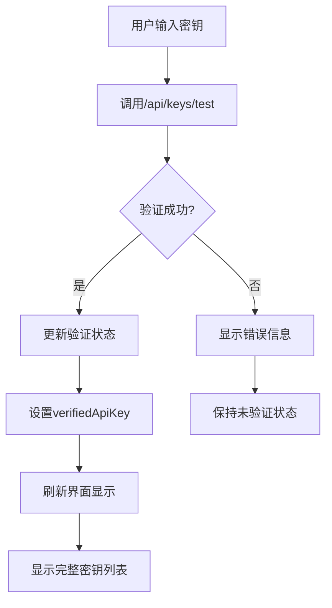
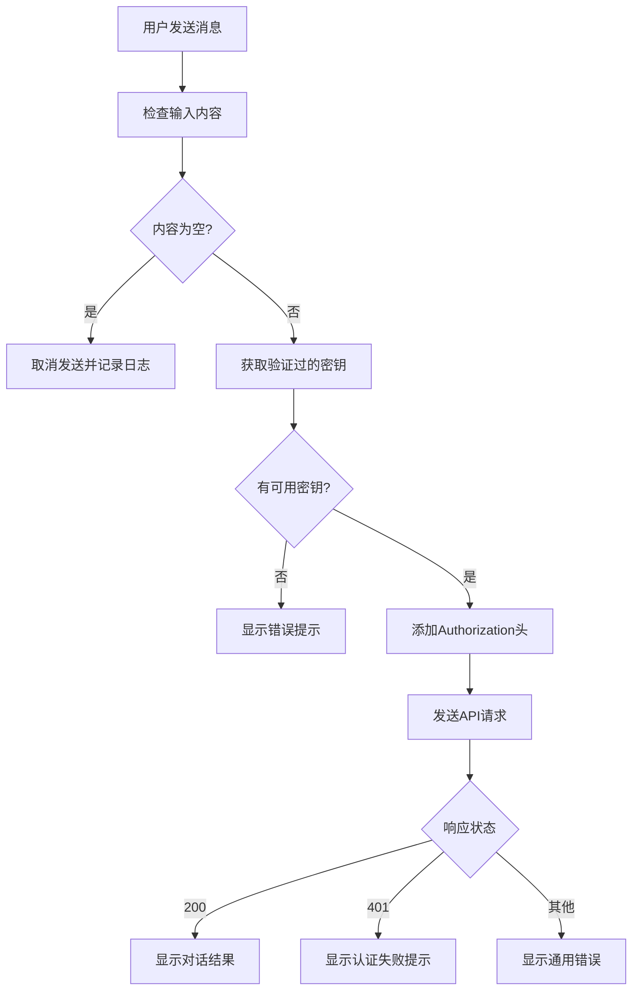

# Web UI 安全功能说明

本文档详细介绍了 AI Studio Proxy Server Web UI 的安全功能和使用方法。

## 概述

Web UI 实现了分级权限的API密钥管理系统，确保只有经过验证的用户才能查看服务器密钥信息，同时提供安全的对话功能。

## 安全特性

### 1. 分级权限查看

- **未验证状态**: 只显示基本的API信息和密钥数量
- **验证成功状态**: 显示完整的服务器密钥列表（打码显示）

### 2. 验证状态管理

- 验证成功后状态在浏览器会话期间保持
- 无需重复验证，提高使用体验
- 可手动重置验证状态

### 3. 安全显示机制

- 所有密钥都经过打码处理：`xxxx****xxxx`
- 保护敏感信息不被完整暴露
- 仍可识别不同密钥的前后缀

### 4. 自动认证机制

- 对话请求自动包含Bearer token认证
- 使用验证过的密钥进行API调用
- 智能错误处理和中文提示

## 使用流程

### 首次使用

1. **访问Web UI**
   ```
   http://localhost:2048/
   ```

2. **进入设置页面**
   - 点击"设置"标签页
   - 查看API密钥管理区域

3. **验证API密钥**
   - 在输入框中输入有效的API密钥
   - 点击"验证密钥"按钮
   - 等待验证结果

4. **查看密钥列表**
   - 验证成功后自动显示服务器密钥列表
   - 所有密钥都经过打码处理
   - 显示添加时间和状态信息

### 日常使用

1. **进行对话**
   - 切换到"聊天"标签页
   - 输入消息内容
   - 系统自动使用验证过的密钥进行认证

2. **管理验证状态**
   - 在密钥列表底部可找到"重置验证状态"按钮
   - 点击可清除当前验证状态
   - 重置后需要重新验证密钥

## 安全机制详解

### 验证流程



### 对话认证流程



## 错误处理

### 常见错误及解决方案

1. **401 认证失败**
   - 原因：API密钥无效或已过期
   - 解决：重新验证有效的API密钥

2. **验证状态丢失**
   - 原因：浏览器会话结束或页面刷新
   - 解决：重新验证密钥

3. **密钥列表无法显示**
   - 原因：网络问题或服务器错误
   - 解决：检查网络连接和服务器状态

4. **无法发送消息**
   - 原因：输入内容为空或认证失败
   - 解决：确保输入有效内容并验证密钥

## 最佳实践

### 安全建议

1. **定期验证密钥**
   - 建议定期重新验证密钥确保有效性
   - 如遇认证问题及时更新密钥

2. **保护浏览器会话**
   - 在公共环境使用后及时关闭浏览器
   - 避免在不安全的网络环境下使用

3. **监控使用日志**
   - 通过侧边栏日志监控API调用状态
   - 注意异常的认证失败记录

### 使用技巧

1. **快速验证**
   - 可以使用键盘Enter键快速提交验证
   - 验证成功后会自动刷新界面

2. **状态管理**
   - 验证状态在标签页间切换时保持
   - 可随时通过重置按钮清除状态

3. **错误诊断**
   - 查看浏览器控制台获取详细错误信息
   - 结合服务器日志进行问题排查

## 技术实现

### 前端实现

- 使用JavaScript管理验证状态
- localStorage用于保存用户偏好设置
- WebSocket实现实时日志显示

### 后端支持

- `/api/keys/test` 端点用于密钥验证
- `/api/keys` 端点返回密钥列表
- `/v1/chat/completions` 端点处理对话请求

### 安全措施

- 密钥打码显示保护敏感信息
- 会话级别的验证状态管理
- 自动认证头添加机制

## 更新日志

### v3.2.4+
- 实现分级权限的API密钥管理
- 添加验证状态管理功能
- 增强对话认证机制
- 改进错误处理和用户提示

---

如有问题或建议，请提交Issue或查看主要文档 [README.md](README.md)。
